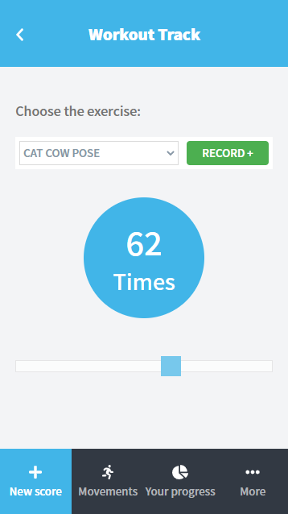
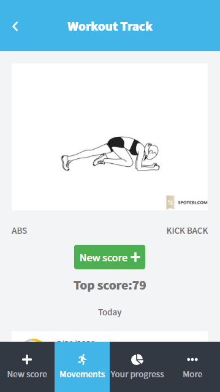
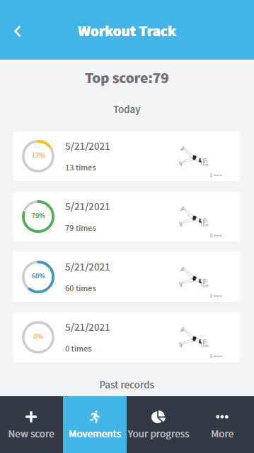
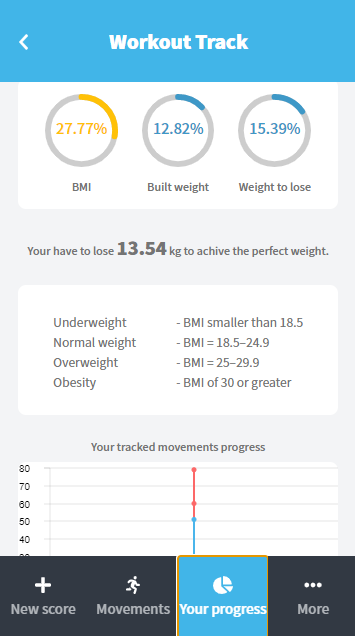

# Workout Track

> This project is a full-stack (React - Rails) single-page web app. It is a tool to track your workout and your body status and medical statistics

<div align="center">






</div>

## Technologies

- Ruby On Rails
- React On Rails
- Cloudinary
- React
- React-Create-App
- React-Redux
- Redux
- npm
- CSS
- ES6

## Live Demo

[Live Demo Link](https://workout-49bf.onrender.com)

## Usage

```
- git clone "https://github.com/Mohamed-js/workout-app.git"
- cd workout-track

```

## Authors

👤 **Mohammed Atef**

- GitHub: [Mohamed Atef](https://github.com/Mohamed-js)
- Twitter: [@Mohamed Atef](https://twitter.com/Demovejetta)
- LinkedIn: [LinkedIn](https://www.linkedin.com/in/mohamed-js/)

## 🤝 Contributing

Contributions, issues, and feature requests are welcome!

## Show your support

Give a ⭐️ if you like this project!

## Acknowledgments

- Notion
- Gregoire Vella - Designer
- Behance

## 📝 License

This project is [MIT](https://github.com/Mohamed-js/Capstone-Project-1/blob/dev-area/LICENSE.md) licensed.
